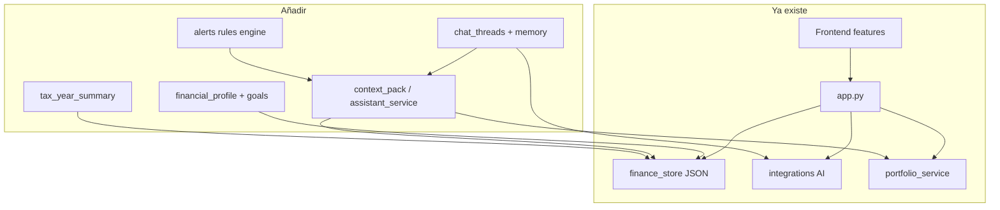

# Plan de Implementación: Asistente Financiero sobre Delfos

> Roadmap de **extensión** del copiloto local-first existente.
> Fuente de verdad de producto/arquitectura: `docs/00_vision.md` + `docs/01_arquitectura.md`.
> Este documento **no** redesigna Delfos: no introduce DB, auth, multi-user ni Clean Architecture.

---

## 1. Objetivo

Extender Delfos para que, además de registrar y visualizar finanzas, actúe como **asistente personal**:

- conocer el perfil y las metas del usuario
- hablar con contexto persistente **sin** quemar tokens
- alertar por reglas verificables
- recomendar acciones concretas
- preparar resúmenes anuales de apoyo (no asesoría fiscal)

Todo sobre el stack actual: JSON + Flask services + Astro/Svelte features + IA vía registry.

---

## 2. Decisión fijada (no negociable en este plan)

| Sí | No |
|----|-----|
| Single-user, local-first | Usuarios, `user_id`, autenticación |
| Extender `delfos_data.json` / `DEFAULT_DATA` | Base de datos / esquema SQL |
| Reusar `expenses`, `incomes`, `investments`, `accounts` | Remodelar a `transactions` genéricas |
| IA vía `integrations/` + preview→confirm | Orquestador “capa de inteligencia” pesada |
| Cálculos en `services/` | Jobs/cron como dependencia del MVP |
| Feature `asistente/` + API en `app.py` | Cambiar capas de `docs/01_arquitectura.md` |

---

## 3. Inventario: qué YA existe (no reconstruir)

Marcado como **implementado**. Las Fases 1–6 **añaden** encima; no sustituyen el núcleo.

### 3.1 Núcleo de finanzas

- Cuentas, gastos, ingresos, notas, categorías; ajuste de saldos
- Dashboard: resumen mensual, movimientos, charts
- Persistencia: `backend/services/finance_store.py` → `delfos_data.json`
- Migraciones suaves en `load_data()` (`_migrate_*`)

### 3.2 Inversiones

- Ledger 10 columnas; import/export CSV/XLSX; OCR preview→confirm
- Portafolio P&L: `portfolio_service` + `quote_service`
- Activos conocidos: `investment_assets`

### 3.3 IA (analyze + confirm)

- `/api/analyze` + `/api/confirm-analysis`
- Adapters: Ollama / Gemini / OpenAI-compatible vía `registry`
- OCR inversiones; API key solo en backend

### 3.4 UI y distribución

- Features: `dashboard`, `inversiones`, `settings`
- Cliente HTTP único: `frontend/src/common/lib/api.ts`
- Store: `stores/finance.ts`
- App escritorio `.exe` (waitress); datos en `%LOCALAPPDATA%\Delfos\data`

**Baseline del asistente = Fase 0.** No hay que “construir base financiera” desde cero.

---

## 4. Visión del asistente (sobre lo existente)

Experiencia objetivo:

1. Primera vez: wizard de onboarding (formulario guiado, no chat obligatorio)
2. Se guarda `financial_profile` + `goals[]` en el JSON
3. El dashboard/KPIs usan perfil + datos ya existentes
4. El usuario abre chat: el backend arma un **context pack** y llama al LLM
5. Alertas nacen de **reglas** (no del LLM); el LLM puede explicarlas
6. Vista anual de apoyo para contador, con wording explícito de no-asesoría

Ejemplos de preguntas:

- ¿Estoy gastando demasiado este mes?
- ¿Puedo invertir más sin afectar mi liquidez?
- ¿Cómo voy contra mi meta de ahorrar 30%?
- ¿Qué debería priorizar este mes?
- Resume mi año para mi contador

---

## 5. Principios

1. **Chat ≠ fuente de verdad.** SoT = JSON (`accounts`, `expenses`, `incomes`, `investments`, `financial_profile`, `goals`, `memory_*`, `alerts`).
2. **Context pack barato.** Nunca enviar el JSON crudo completo al LLM.
3. **Cálculo en services; LLM interpreta.** Mutaciones sensibles: preview → confirm (mismo patrón que analyze/OCR).
4. **Alertas por reglas.** El LLM explica; no inventa el trigger.
5. **Sin scheduler.** Resúmenes on-demand (abrir chat, completar onboarding, mutaciones relevantes). Compatible con `.exe` local.
6. **Arquitectura actual.** `app.py` → `services/` → JSON / `integrations/`. Frontend solo vía `api.ts`.

---

## 6. Extensión del store JSON

Archivo: `delfos_data.json` vía `finance_store.DEFAULT_DATA` + migración suave en `load_data()` (mismo patrón que `_migrate_categories`, etc.).

### 6.1 Entidades actuales (no duplicar)

Ya viven en el JSON y se reutilizan tal cual:

- `settings`, `categories`, `accounts`, `expenses`, `incomes`, `investments`, `investment_assets`, `notes`

### 6.2 Claves nuevas en `DEFAULT_DATA`

```text
financial_profile   # objeto (o {} vacío)
goals               # []
alerts              # []
recommendations     # []   # opcional: cache; puede regenerarse on-demand
chat_threads        # []
chat_messages       # []
memory_facts        # []
memory_summaries    # []
```

Migración: si falta la clave, inicializar con default; reescribir solo si hubo cambios.

### 6.3 Contratos de campos (spec Fase 1)

#### `financial_profile`

| Campo | Tipo | Notas |
|-------|------|--------|
| `monthly_income_fixed` | number \| null | COP u moneda base |
| `monthly_income_variable_avg` | number \| null | |
| `savings_target_percent` | number \| null | 0–100 |
| `investment_target_percent` | number \| null | |
| `emergency_fund_target_months` | number \| null | |
| `risk_profile` | string \| null | p.ej. `conservative` \| `moderate` \| `aggressive` |
| `investment_horizon` | string \| null | p.ej. `short` \| `medium` \| `long` |
| `fiscal_country` | string \| null | default sugerido `CO` |
| `priorities` | string[] | |
| `onboarding_completed` | boolean | default `false` |
| `last_reviewed_at` | ISO string \| null | |

Sin `user_id`. Un solo perfil local.

#### `goals[]`

| Campo | Tipo |
|-------|------|
| `id` | string (`goal_001`, vía `_next_id`) |
| `type` | string (`emergency_fund`, `savings`, `investment`, `debt`, `custom`, …) |
| `title` | string |
| `target_amount` | number \| null |
| `target_date` | date string \| null |
| `monthly_target` | number \| null |
| `status` | `active` \| `paused` \| `done` \| `cancelled` |
| `priority` | number (menor = más urgente) |
| `notes` | string \| null |
| `created_at` / `updated_at` | ISO |

#### `alerts[]`

Generadas por motor de reglas (Fase 4), no por el LLM.

| Campo | Tipo |
|-------|------|
| `id` | string |
| `alert_type` | string (código estable de regla) |
| `severity` | `info` \| `warning` \| `critical` |
| `status` | `open` \| `acked` \| `resolved` \| `dismissed` |
| `title` | string |
| `body` | string |
| `payload` | object | métricas que dispararon la regla |
| `triggered_at` | ISO |
| `updated_at` | ISO |

#### `recommendations[]` (opcional)

Cache regenerable: `id`, `kind`, `title`, `body`, `priority`, `status`, `source` (`rules` \| `llm`), `created_at`. Si se prefiere YAGNI: omitir clave y generar on-demand hasta Fase 4+.

#### `chat_threads[]` / `chat_messages[]`

| Thread | Message |
|--------|---------|
| `id`, `title`, `created_at`, `updated_at` | `id`, `thread_id`, `role` (`user` \| `assistant` \| `system`), `content`, `created_at` |

#### `memory_facts[]` / `memory_summaries[]`

| Facts | Summaries |
|-------|-----------|
| `id`, `fact`, `category`, `source`, `created_at`, `active` | `id`, `scope` (`global` \| `thread` \| `period`), `summary`, `updated_at` |

Hechos = preferencias/restricciones estables. Summaries = texto barato en tokens, no dump de movimientos.

---

## 7. Context packing (principio central)

Cada llamada de chat recibe un pack armado en backend (`assistant_service` o `context_service`), **no** el JSON crudo.

Orden sugerido del prompt:

1. System prompt Delfos (copiloto; no asesoría fiscal definitiva; no inventar números)
2. `financial_profile` resumido
3. KPIs ya calculados (`build_summary` + portfolio + % ahorro vs meta + liquidez/emergencia)
4. Metas activas + alertas abiertas
5. Memory summary + últimos N facts
6. Últimos M mensajes del thread
7. Pregunta actual

Reglas:

- Cálculos siempre en services (`finance_store`, `portfolio_service`, helpers del assistant).
- LLM interpreta y propone; si sugiere mutar datos → preview → confirm.
- Sin RAG/vector DB en el roadmap.

---

## 8. Capas técnicas (dónde va cada cosa)



| Capa | Qué hacer |
|------|-----------|
| **Backend API** | Rutas nuevas en `app.py` (validar + delegar). Mutaciones relevantes pueden devolver `finance_response(...)` o payload específico + refresh. |
| **Backend services** | CRUD perfil/metas/chat/memory en store; `assistant_service` (pack + chat); motor de reglas; resumen tributario anual derivado del ledger. |
| **Integrations** | Solo vía `registry.get_active_integration().complete_json(...)`. Sin acoplar a un proveedor. |
| **Frontend** | Feature `features/asistente/` (chat, alertas UI). Onboarding inicial: wizard en `dashboard` o `settings`. Tipos en `lib/types.ts`; llamadas solo en `lib/api.ts`. Store: extender `finance` o store mínimo de threads. |

**Auth:** no aplica.

---

## 9. Spec implementable Fase 1–2 (endpoints y flujos)

### 9.1 Endpoints sugeridos

| Método | Ruta | Acción |
|--------|------|--------|
| GET/PATCH | `/api/assistant/profile` | Leer / actualizar `financial_profile` |
| GET/POST | `/api/assistant/goals` | Listar / crear meta |
| PATCH/DELETE | `/api/assistant/goals/<id>` | Editar / borrar |
| GET | `/api/assistant/context` | Context pack (KPIs + perfil + metas + alertas + memory) **sin** llamar LLM |
| GET/POST | `/api/assistant/threads` | Listar / crear thread |
| GET | `/api/assistant/threads/<id>/messages` | Historial |
| POST | `/api/assistant/chat` | Mensaje usuario → pack → LLM → guarda assistant message |
| GET | `/api/assistant/alerts` | Listar alertas |
| PATCH | `/api/assistant/alerts/<id>` | ack / dismiss / resolve |
| GET | `/api/assistant/tax-year?year=YYYY` | Resumen anual de apoyo (Fase 6) |

Nombres finales pueden ajustarse; el contrato (JSON local, sin `user_id`) no.

### 9.2 Flujo onboarding (Fase 1)

Wizard por pasos (UI), no chat complejo:

1. Contexto básico: moneda ya en `settings`; país fiscal; ingresos fijo/variable
2. Metas: % ahorro/inversión; meses de emergencia; 1–3 goals
3. Riesgo/horizonte/prioridades
4. Marcar `onboarding_completed = true`

Puede sugerir (sin forzar) cuentas que falten según tipos existentes (`savings`, `broker`, …) — reutilizando CRUD de cuentas.

### 9.3 Contrato del context pack (JSON de servicio)

```json
{
  "profile": { "...campos resumidos..." },
  "kpis": {
    "month_summary": {},
    "savings_vs_target_percent": null,
    "emergency_months_approx": null,
    "portfolio": {}
  },
  "goals": [],
  "alerts_open": [],
  "memory_summary": null,
  "memory_facts": [],
  "thread_tail": []
}
```

`GET /api/assistant/context` expone esto para UI/debug; `POST /api/assistant/chat` lo usa internamente.

---

## 10. Capacidades por fase (qué construir vs qué no)

### Fase 0 — Inventario / baseline

- **Esfuerzo:** 0 (este documento).
- **Hacer:** tratar §§3–6 como contrato.
- **No:** reescribir núcleo ni “documento técnico de DB”.

### Fase 1 — Perfil + metas + onboarding — **HECHA**

- Extensión `DEFAULT_DATA` + `_migrate_assistant`
- CRUD API perfil/metas (`/api/assistant/profile`, `/api/assistant/goals`)
- Wizard UI en `/perfil` + banner en dashboard
- **No** incluido (correcto): chat onboarding complejo; auth

### Fase 2 — KPIs de copiloto — **HECHA**

- Ahorro vs meta; liquidez / meses de emergencia (aprox. desde saldos + perfil)
- Concentración portafolio por costo (`assistant_service` + `portfolio_accounting`)
- Endpoint `GET /api/assistant/context` + `assistant_kpis` en `/api/finance`
- UI: ProfilePeek en inicio, `/perfil` con cards, acceso en BottomNav
- **No** incluido (correcto): snapshots diarios con cron

### Fase 3 — Chat contextual — **HECHA**

- Feature `/asistente`: chat conversacional (no quiz), thread principal, `complete_json`
- Prompt builder + context pack; memory_facts / memory_summaries mínimos
- **No** incluido (correcto): RAG / vector DB

### Fase 4 — Alertas + recomendaciones (~1–2 sem)

- Motor de reglas al leer/mutar (o al pedir context/chat)
- UI alertas; LLM explica opcionalmente
- **No:** “agente proactivo” siempre-on con jobs

### Fase 5 — Planes por meta (~1–2 sem)

- Plan derivado de goal + métricas; pasos accionables
- **No:** simulaciones multi-escenario

### Fase 6 — Tributario de apoyo (~1–2 sem)

- Vista anual desde ledger (dividendos, fees, ventas, patrimonio a corte)
- Borrador de texto para contador
- **No:** asesoría fiscal / DIAN definitiva

---

## 11. MVP útil

**Fases 1 + 2 + chat consultivo mínimo de Fase 3** ≈ **3–4 semanas**.

Criterio MVP:

- perfil y ≥1 meta guardados
- KPIs vs meta visibles o en context pack
- un thread de chat que responde con números del pack (no alucinados del JSON crudo)
- sin DB, sin login, sin cron

---

## 12. Motor de reglas (Fase 4) — ejemplos

Reglas deterministas sobre datos ya calculados:

| `alert_type` | Condición guía |
|--------------|----------------|
| `overspend_vs_avg` | gasto mes >> promedio N meses |
| `savings_below_target` | % ahorro < `savings_target_percent` |
| `low_liquidity` | meses emergencia < target |
| `high_concentration` | un activo > umbral del portafolio |
| `goal_behind` | ritmo vs `monthly_target` / fecha |

Salida → filas en `alerts[]`. Recomendaciones: mismo motor o LLM solo para redacción, anclado a `payload` numérico.

---

## 13. Chat: diseño funcional (Fase 3)

Modos (prompt/instrucciones; no microservicios):

1. **Consultivo** — responde con KPIs del pack
2. **Diagnóstico** — prioriza alertas + desviaciones
3. **Planeación** — une metas + pasos (Fase 5)
4. **Ejecución guiada** — propone mutaciones vía preview→confirm (analyze existente o confirm dedicado)

Herramientas del chat = servicios internos del backend (summary, portfolio, goals), no tool-calling multi-agente obligatorio en MVP.

---

## 14. Backlog priorizado

**Alta (MVP):**

- clave JSON + migrate perfil/goals
- endpoints profile/goals/context
- wizard onboarding
- KPIs ahorro / emergencia / concentración
- threads + chat + prompt builder
- memory_summary + facts mínimos

**Media:**

- motor de alertas + UI
- recommendations on-demand
- planes por meta
- vista tax-year + borrador contador

**Fuera / más adelante:**

- simulaciones multi-escenario
- agente proactivo con scheduler
- RAG / embeddings
- multi-user / sync nube / auth

---

## 15. KPIs de producto (asistente)

- Onboarding completado (`onboarding_completed`)
- Metas activas
- Uso del chat (threads/mensajes por semana)
- Alertas abiertas vs resueltas
- Ahorro mensual vs meta (KPI de Fase 2)
- Precisión percibida (respuestas ancladas a pack)

Sin “por usuario”: es single-user local.

---

## 16. Riesgos (versión Delfos)

| Riesgo | Mitigación |
|--------|------------|
| Chat como SoT | Persistencia en profile/goals/facts/summaries; mensajes solo historial |
| Tokens | Context pack + summaries; límite N/M en tail |
| Recomendaciones flojas | Reglas + métricas verificadas; LLM explica |
| Bruto vs neto en inversiones | Alinear wording con `portfolio_service` / ledger existentes |
| Tributario malinterpretado | Wording de apoyo en prompts y UI; no DIAN |

---

## 17. Fuera de alcance (explícito)

No implementar ni dejar como “siguiente documento técnico”:

- `users`, `user_id`, autenticación, multi-tenant
- esquema SQL / ORM / “tablas” como entregable
- unificar movimientos en `transactions` genéricas
- jobs programados / cron / workers como dependencia
- Clean Architecture, IoC, use cases formales, “capa de inteligencia” separada
- RAG / vector DB
- asesoría fiscal definitiva o declaración DIAN

---

## 18. Orden de implementación

1. Extender JSON (perfil + goals) + migrate  
2. Onboarding UI + API  
3. KPIs copiloto + `GET .../context`  
4. Memoria mínima + chat + prompt builder  
5. Reglas de alertas  
6. Planes por meta  
7. Vista tributaria de apoyo  

No empezar por “un chat potente” sin perfil ni pack.

---

## 19. Próximo paso

**Fases 1–3 hechas.** Siguiente: **Fase 4** — alertas por reglas + recomendaciones accionables.
