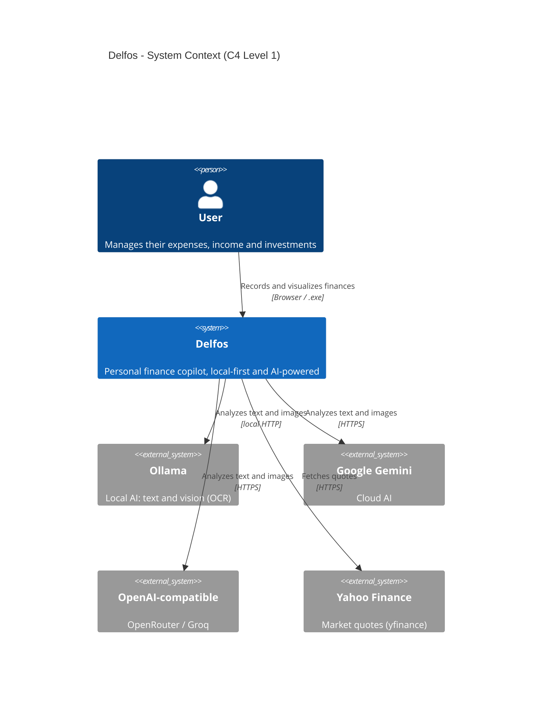
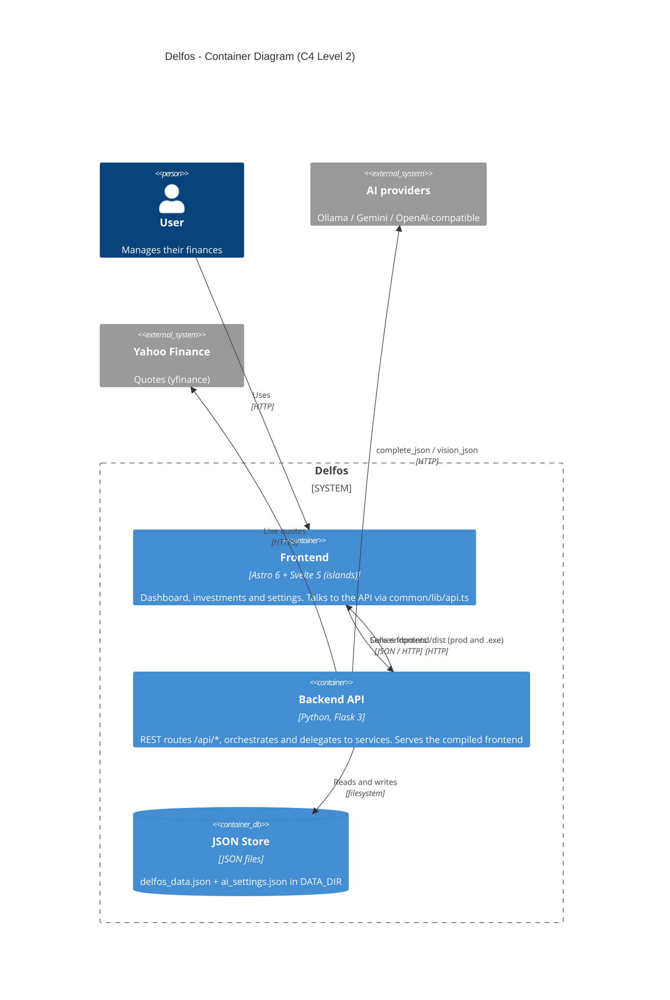
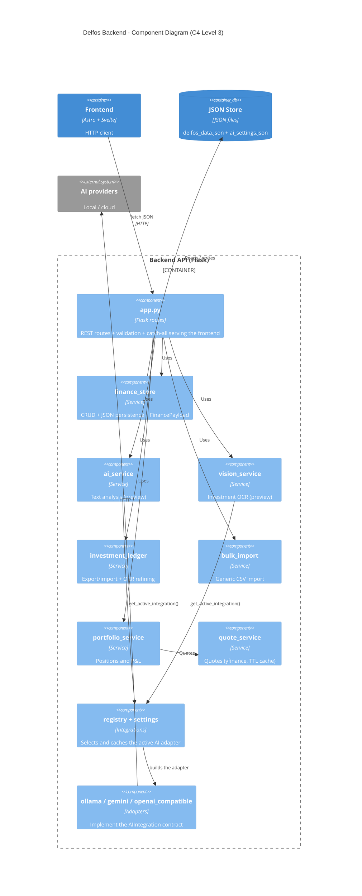
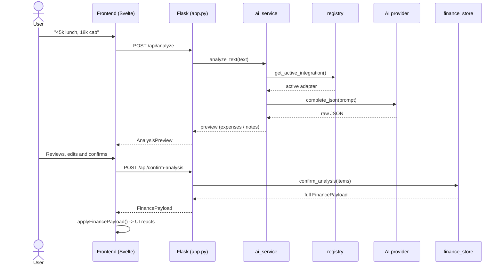

<div align="center">


# Delfos

### Personal finance copilot — local-first, AI-optional

Capture expenses, income and investments via **text, voice, CSV or photo**.  
Dashboard + investment ledger. AI proposes; **you confirm**.  
Your data stays in local JSON files. No cloud account required.

[](LICENSE)


[Español](README.md) · **English** · [Features](docs/02_funcionalidades.md) · [Architecture](docs/01_arquitectura.md)

</div>

---

## 📸 Preview

<!-- Drop your screenshots in docs/assets/ and uncomment the images:
<div align="center">


</div>
-->

> 📷 _Screenshots coming soon._ Drop `dashboard.png` and `inversiones.png` into [`docs/assets/`](docs/assets/) and uncomment the image block above.

---

## ✨ What it does

- 📊 **Finance dashboard** — accounts, expenses, income, investments, notes and categories in a single view, with monthly summary, balances per account and recent movements.
- 🎙️ **Frictionless capture** — manual entry, **voice** (dictation), **AI text analysis** ("45k on lunch and 18k on a cab") and **bulk CSV import**.
- 🤖 **AI proposes, you confirm** — AI structures your movements into a **preview**; nothing is saved without your confirmation.
- 📈 **Investments** — a 10-column **ledger** with **CSV/XLSX** export, **CSV** import, broker-screenshot **OCR**, and a **portfolio** with market value and P&L (live quotes).
- 🔌 **Swappable AI** — **local** provider (Ollama) or **cloud** (Gemini / OpenRouter / Groq), selectable from Settings. Your API key never leaves the backend.
- 🖥️ **Desktop app** — a portable Windows `.exe` that serves frontend + API in a single process, no Docker or Node required.

> Manual entry and imports **work without AI**. AI is an accelerator, not a requirement.

---

## 🗺️ Architecture (C4 model)

> Delfos uses a deliberately simple architecture: **Flask by services** + **Astro/Svelte by features**. No Clean Architecture, no IoC, no ORM. The detailed source of truth is in [`docs/01_arquitectura.md`](docs/01_arquitectura.md).

### Level 1 — System Context

Who uses Delfos and which external systems it talks to.



### Level 2 — Containers

The runnable pieces and where data lives.



### Level 3 — Backend Components

How work is split inside the Flask API.



---

## 🔄 AI flow (analyze → confirm)

Delfos's key pattern: **AI never persists without confirmation.**



> If no AI is configured or the JSON fails, the text is saved as a **note** (fallback). The same preview→confirm pattern applies to investment **OCR**, starting from an image.

---

## 🧰 Tech stack

| Layer | Technology |
|-------|------------|
| Frontend | Astro 6 · Svelte 5 (islands) · TypeScript · Vite |
| Backend | Python ≥ 3.10 · Flask 3 · flask-cors · managed with `uv` |
| Persistence | Local JSON files (no database) |
| AI — local | Ollama (text + vision) |
| AI — cloud | Google Gemini · OpenAI-compatible (OpenRouter, Groq) |
| Quotes | yfinance (Yahoo Finance) with in-memory TTL cache |
| Packaging | PyInstaller + waitress → Windows `.exe` |
| Docker | nginx (frontend) + Flask (API), same origin, no CORS |

---

## 📁 Project structure

```
delfos/
├── backend/                 # Flask API (Python)
│   ├── app.py               # REST routes + catch-all serving frontend/dist
│   ├── config.py            # .env, DATA_DIR, FRONTEND_DIR, OLLAMA_*, FLASK_*
│   ├── services/            # Business logic + JSON persistence
│   │   ├── finance_store.py     # data core + payload
│   │   ├── ai_service.py        # text analysis (preview)
│   │   ├── vision_service.py    # investment OCR (preview)
│   │   ├── investment_ledger.py # export/import + OCR refining
│   │   ├── bulk_import.py       # generic CSV import
│   │   ├── portfolio_service.py # positions and P&L
│   │   └── quote_service.py     # quotes (yfinance)
│   ├── integrations/        # Swappable AI providers
│   │   ├── base.py              # AIIntegration + IntegrationError
│   │   ├── settings.py          # config + secrets (api_key)
│   │   ├── registry.py          # active adapter selection + cache
│   │   ├── ollama.py            # local adapter
│   │   ├── gemini.py            # cloud adapter
│   │   └── openai_compatible.py # cloud adapter (OpenRouter / Groq)
│   ├── data/                # JSON store (gitignored)
│   └── tests/               # unittest
├── frontend/                # Astro + Svelte
│   └── src/
│       ├── pages/           # index · inversiones · configuracion (.astro)
│       ├── features/        # dashboard · inversiones · settings
│       └── common/          # atoms/molecules/organisms · lib/api.ts · stores · styles
├── docs/                    # Source of truth (vision + architecture)
├── .cursor/                 # Rules and skills for working with agents
├── agentic-framework/       # Agentic working method (portable)
├── legacy/                  # Original Jinja templates (reference)
└── docker-compose.yml
```

---

## 🚀 Getting started

> **For local AI / OCR:** [Ollama](https://ollama.com) running on the host with a text model and a **vision** model (for OCR). Cloud AI does not require Ollama.

### Option A — Local development (Windows / PowerShell)

**Terminal 1 — API**

```powershell
cd backend
$env:OLLAMA_URL="http://127.0.0.1:11434"
$env:OLLAMA_MODEL="llama3.2"
$env:OLLAMA_VISION_MODEL="llava"   # ollama pull llava (required for local OCR)
uv sync
uv run python app.py
```

API at http://127.0.0.1:5000 → returns `{"service":"delfos-api"}`.

**Terminal 2 — UI**

```powershell
cd frontend
npm install
npm run dev
```

App at http://localhost:4321 (investments at http://localhost:4321/inversiones).
Set `PUBLIC_API_BASE_URL=http://localhost:5000` in `frontend/.env`.

### Option B — Docker (full stack)

```powershell
# Install a vision model on the host's Ollama (required for OCR)
ollama pull llava        # lighter alternative: ollama pull moondream

docker compose up --build
```

- App: **http://localhost:8080** · Investments: **http://localhost:8080/inversiones**
- API proxied at `/api/*` (same origin, no CORS) · Data in `./backend/data`
- Ollama reachable at `http://host.docker.internal:11434` from the container.

### Option C — Desktop app (portable `.exe`)

```powershell
powershell -ExecutionPolicy Bypass -File .\build_exe.ps1
```

- Output: `backend\dist\Delfos.exe` (~38 MB). Double-click → starts at `http://localhost:5000` and opens the browser.
- Data persisted in `%LOCALAPPDATA%\Delfos\data` (survives closes and reinstalls).
- For AI without installing Ollama, configure a cloud provider (Gemini / OpenRouter) from **Settings**. Manual entry works without AI.
- The `.exe` is Windows-specific; for Mac/Linux you must build on each OS.

---

## 🤖 Configuring AI

From the **Settings** screen (or `POST /api/settings/ai`) you pick the provider:

| Provider | `provider` | Notes |
|----------|-----------|-------|
| Ollama (local) | `local` | Requires Ollama running; OCR needs a vision model (`llava`, `moondream`) |
| Google Gemini | `gemini` | Requires your API key |
| OpenAI-compatible | `compatible` | OpenRouter / Groq; requires `base_url` + API key |

- If `cloud_enabled = false`, the effective provider is **always `local`**.
- The **API key lives only in the backend**; the client only gets it masked (`masked_key`).
- Health and connection test: `GET /api/ai/health` and `POST /api/settings/ai/test`.

---

## 🔗 API (summary)

Base: `/api`. Mutating routes return the full `FinancePayload` so the UI can refresh in a single response.

| Method | Route | Action |
|--------|-------|--------|
| `GET` | `/api/finance` | Full finance state |
| `GET` | `/api/charts` | Chart data |
| `POST·PATCH·DELETE` | `/api/{accounts,expenses,incomes,investments,notes,categories}` | CRUD |
| `POST` | `/api/analyze` · `/api/confirm-analysis` | AI analysis (preview → confirm) |
| `POST` | `/api/investments/ocr` · `/api/investments/ocr/confirm` | Investment OCR |
| `GET` | `/api/investments/export.csv` · `export.xlsx` | Ledger export |
| `POST` | `/api/{investments,expenses,incomes,notes,accounts}/import.csv` | CSV import |
| `GET` | `/api/investments/portfolio` | Positions and P&L |
| `GET·POST` | `/api/settings/ai` · `/api/settings/ai/test` | AI config |
| `GET` | `/api/ai/health` · `/api/ollama/health` | Health checks |

> Full list and service mapping in [`docs/01_arquitectura.md`](docs/01_arquitectura.md).

---

## 🧪 Tests

```powershell
cd backend
uv sync
uv run python -m unittest tests.test_api -v
```

---

## 📚 Documentation

- [`docs/00_vision.md`](docs/00_vision.md) — Product vision: problem, users, scope, business rules and glossary (Spanish).
- [`docs/01_arquitectura.md`](docs/01_arquitectura.md) — Real architecture: layers, folders, data flows, AI pattern and rules for agents (Spanish).
- [`agentic-framework/`](agentic-framework/README.md) — Agentic working method (skills, structure and flow), portable across projects (Spanish).

---

<div align="center">

Built around what's simple and works. **Your finances, your data, your copilot.**

</div>
